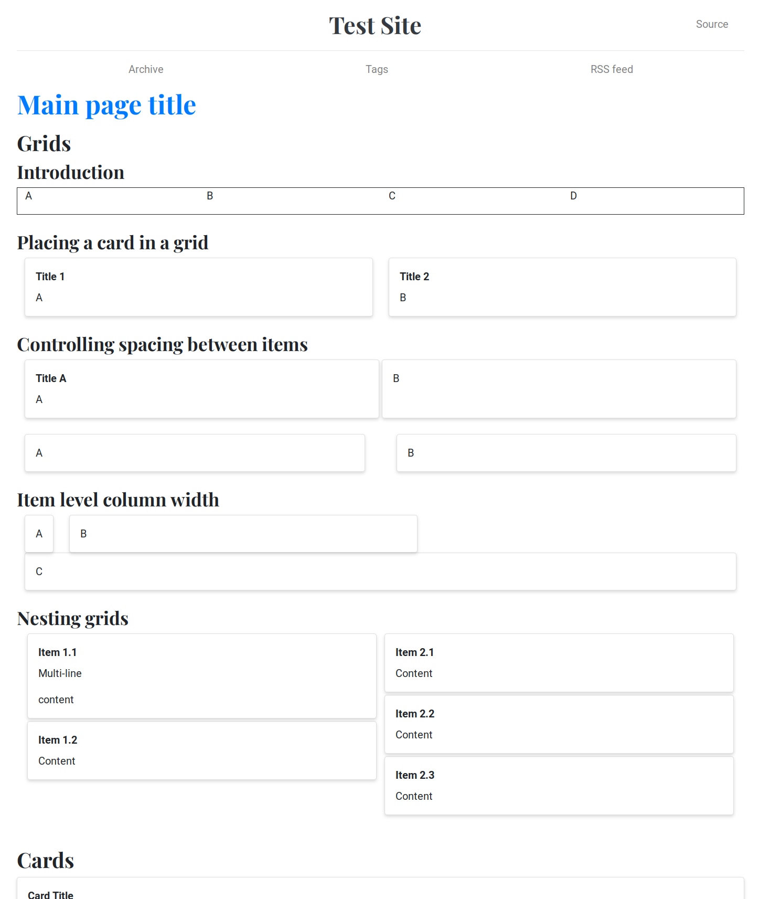

Nikola with sphinx-design
==========================

Sample Nikola site using [sphinx-design](https://github.com/executablebooks/sphinx-design) directives for bootstrap-like cards without writing raw HTML.

Needs a recent sass compiler (otherwise you get errors about `math.div`).

Otherwise just run `nikola auto`

[plugins/sphinxdesign/sphinxdesign.py] contains Sphinx stubs so that sphinx-design can be loaded and used unmodified as if inside sphinx. Not everything is working, but the panels do.

The sample page is composed from examples showing [various components of sphinx-design](https://sphinx-design.readthedocs.io/en/furo-theme/grids.html).

